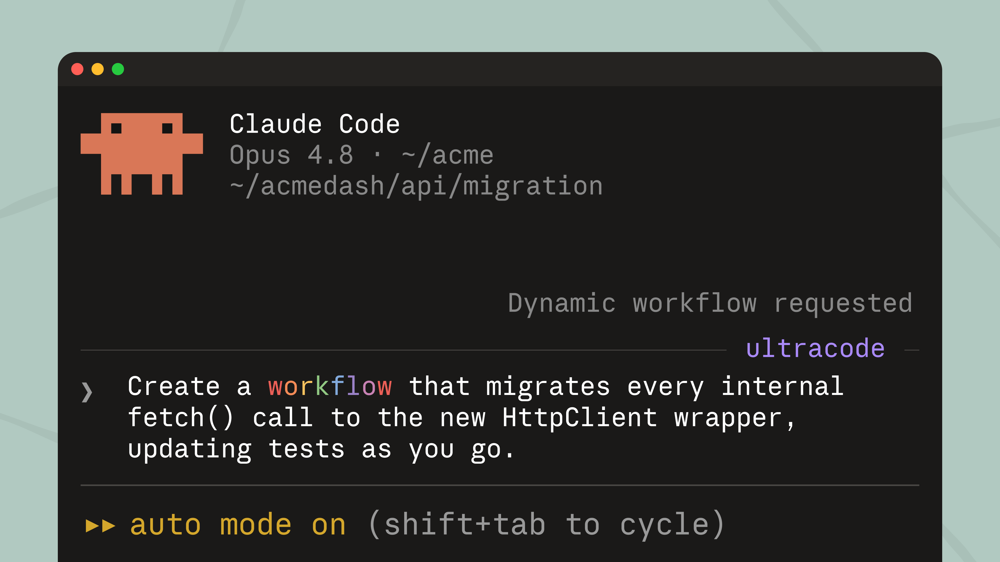

> ## Documentation Index
> Fetch the complete documentation index at: https://code.claude.com/docs/llms.txt
> Use this file to discover all available pages before exploring further.

# Week 22 · May 25–29, 2026

> Run Claude Code on Claude Opus 4.8, orchestrate large tasks with dynamic workflows, catch security issues with the security-guidance plugin, and use fast mode on Opus 4.8 at a lower price.

  <span>Releases <a href="../changelog.md#2-1-150">v2.1.150 → v2.1.157</a></span>
  <span>4 features · May 25–29</span>

    Claude Opus 4.8
    new model

  Opus 4.8 is now the default on Max, Team Premium, Enterprise pay-as-you-go, and the Anthropic API. It defaults to high effort; use <code>/effort xhigh</code> for harder tasks. Requires v2.1.154 or later.

  [Video demo](https://mintcdn.com/claude-code/QsIrGXGFg6xd7joy/images/whats-new/opus-4-8.mp4?fit=max&auto=format&n=QsIrGXGFg6xd7joy&q=85&s=6ebcf5fe136467da2b254de1fe749ea7)

  Switch to Opus 4.8 by name, or pick it from the model picker:

  ```text title="Claude Code" wrap theme={null}
  /model claude-opus-4-8
  ```

  <a href="../model-config.md#available-models">Model configuration</a>

    Dynamic workflows
    research preview

  A workflow is an orchestration script Claude writes for your task and runs across many subagents in the background. Use one when a task is too large for one conversation to coordinate: a codebase-wide audit, a large migration, a research question that needs cross-checking. Manage runs with <code>/workflows</code>.

  

  Describe the task and ask for a workflow:

  ```text title="Claude Code" wrap theme={null}
  create a workflow that migrates every internal fetch() call to the new HttpClient wrapper
  ```

  <a href="../workflows.md">Dynamic workflows</a>

    Security guidance plugin
    plugin

  The security-guidance plugin reviews Claude's code changes for vulnerabilities and fixes them in the same session. It runs a fast pattern check on each edit, a model review at the end of each turn, and a deeper agentic review on commit or push. Add project rules in <code>.claude/claude-security-guidance.md</code>.

  [Video demo](https://mintcdn.com/claude-code/QsIrGXGFg6xd7joy/images/whats-new/security-guidance.mp4?fit=max&auto=format&n=QsIrGXGFg6xd7joy&q=85&s=c91d865936411586f42b24c558bcdd1d)

  Install it from the official Anthropic marketplace:

  ```text title="Claude Code" wrap theme={null}
  /plugin install security-guidance@claude-plugins-official
  ```

  Then activate it in the current session:

  ```text title="Claude Code" wrap theme={null}
  /reload-plugins
  ```

  <a href="../security-guidance.md">Security guidance plugin</a>

    Fast mode on Opus 4.8
    research preview

  Fast mode now defaults to Opus 4.8 at \$10/\$50 per MTok: 2x the standard rate for about 2.5x the speed. Opus 4.7 and 4.6 stay at \$30/\$150. Opus 4.6 fast mode is deprecated.

  Toggle fast mode, now on Opus 4.8:

  ```text title="Claude Code" wrap theme={null}
  /fast
  ```

  <a href="../fast-mode.md#understand-the-cost-tradeoff">Fast mode pricing</a>

  Other wins

    <div>In <code>claude agents</code>, prefix a shell command with <code>!</code> to run it as a background job you can attach to and detach from; also available as <code>claude --bg --exec 'pytest -x'</code></div>
    <div>Plugins in <code>.claude/skills</code> directories are now loaded automatically, no marketplace required, and <code>claude plugin init \<name></code> scaffolds a new plugin</div>
    <div>New <code>/reload-skills</code> command re-scans skill directories without restarting, and <code>SessionStart</code> hooks can return <code>reloadSkills: true</code> to make skills they install available in the same session</div>
    <div>Skills and commands can set <code>disallowed-tools</code> in frontmatter to remove tools from the model while the skill is active</div>
    <div>New <code>MessageDisplay</code> hook event lets hooks transform or hide assistant message text as it is displayed</div>
    <div>Claude Code now switches to your configured <code>--fallback-model</code> for the rest of the session when the primary model is not found, instead of failing every request</div>
    <div>Plugins can declare <code>defaultEnabled: false</code> in <code>plugin.json</code> or a marketplace entry, so they install without turning on until you enable them</div>
    <div>Vim mode: <code>/</code> in NORMAL mode opens reverse history search, matching Bash and Zsh vi-mode</div>
    <div>Streaming tool execution is now always enabled, including with telemetry disabled and on Amazon Bedrock, Google Cloud's Agent Platform, and Microsoft Foundry</div>
    <div><code>←←</code> to open the agents view now works on Amazon Bedrock, Google Cloud's Agent Platform, Microsoft Foundry, and with telemetry disabled</div>
    <div>Claude in Chrome: pick which connected browser to use via <code>/chrome</code> → "Select browser…", or in-chat when a browser action runs with multiple connected</div>
    <div><code>claude mcp list</code> and <code>claude mcp get</code> now show unapproved <code>.mcp.json</code> servers as pending approval instead of auto-approving and connecting when output is piped</div>

[Full changelog for v2.1.150–v2.1.157 →](../changelog.md#2-1-150)
