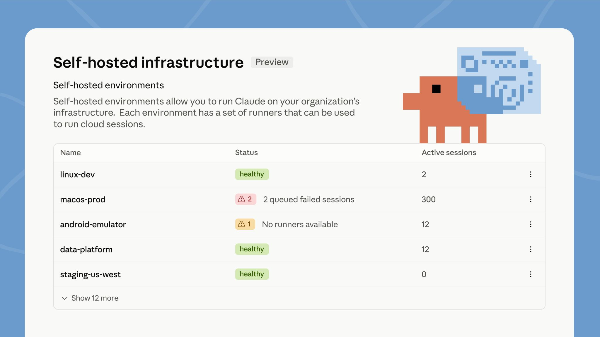

> ## Documentation Index
> Fetch the complete documentation index at: https://code.claude.com/docs/llms.txt
> Use this file to discover all available pages before exploring further.

# Week 32 · August 3–7, 2026

> Claude Code sessions message each other, self-hosted environments run cloud sessions on your infrastructure, and auto mode becomes the default permission mode.

  <span>Releases <a href="../changelog.md#2-1-220">v2.1.220 → v2.1.224</a></span>
  <span>3 features · August 3–7</span>

    Cross-session messaging
    v2.1.224

  Your Claude Code sessions can now message each other. Claude discovers your other sessions with the <code>ListAgents</code> tool and sends with <code>SendMessage</code>, either when you ask it to or on its own, such as after a change in one session affects what another is working on. A message is text Claude writes for the other session, never your conversation history or files. Available on macOS and Linux. Requires v2.1.224 or later.

  [Video demo](https://mintcdn.com/claude-code/N3yEaTYPXMXFrF6k/images/whats-new/cross-session-messaging.mp4?fit=max&auto=format&n=N3yEaTYPXMXFrF6k&q=85&s=8f33c3390f78660a4a26dc980f46159f)

  With two sessions open on the same machine, ask one of them to pass something along:

  ```text title="Claude Code" wrap theme={null}
  Tell the session working on the payments API that users.name is now users.display_name
  ```

  The other session shows a <code>Message from</code> row once Claude has read the message; press <code>Ctrl+O</code> to expand it. To see which sessions Claude can reach, run <code>/list-agents</code>.

  <a href="../cross-session-messaging.md#message-another-session">Message another session</a>

    Self-hosted environments
    v2.1.224

  Self-hosted environments run Claude Code cloud sessions on your organization's own infrastructure, in public beta on Team and Enterprise plans. Run <code>claude self-hosted-runner</code> on your machines or containers to turn them into runners. When someone picks your environment while starting a session from claude.ai, the mobile or desktop apps, or `claude --cloud`, that session runs inside your network, with access to your internal services. An Owner turns on <strong>Allow self-hosted environments</strong> in <a href="https://claude.ai/admin-settings/cloud-environments">admin settings</a> first.

  

  Signed in as an Owner, run the guided setup, which walks you through creating the environment and starts a runner:

  ```bash terminal theme={null}
  claude self-hosted-runner setup
  ```

  The environment shows <strong>Healthy</strong> in admin settings once the runner registers.

  <a href="../self-hosted-environments-quickstart.md#set-up-an-environment-and-runner">Self-hosted environments quickstart</a>

    Auto mode becomes the default
    CLI

  Starting August 14, auto mode is the default permission mode for new sessions on Pro, Max, and Team plans. If you set a default mode yourself, it stays in place unless you accept the one-time switch prompt, and a default your organization manages doesn't change. You can still switch modes at any time. Already in effect on those plans: the classifier calls auto mode makes no longer count toward your usage limits.

  To start every session in auto mode before the switch, set it as your default in your user settings:

  ```json ~/.claude/settings.json {3} theme={null}
  {
    "permissions": {
      "defaultMode": "auto"
    }
  }
  ```

  New sessions then show <code>auto mode on</code> in the status bar.

  <a href="../permission-modes.md#eliminate-prompts-with-auto-mode">Auto mode requirements and controls</a>

  Other wins

    <div>The VS Code extension gets <a href="../vs-code.md#extension-settings">Focus view</a>, which hides tool activity behind one expandable row per turn; toggle it from the command menu or with <code>Ctrl+Alt+F</code> (<code>Ctrl+Option+F</code> on Mac)</div>
    <div>Sandbox credential files accept <a href="../sandboxing.md#mask-credential-files"><code>mode: "mask"</code></a> on Linux and WSL2, so sandboxed commands read a sentinel copy while the sandbox proxy substitutes the real value on egress; credential masking also gains <code>extract</code>, JWT-aware <code>decode</code>, and AWS SigV4 re-signing options</div>
    <div>Marketplaces can distribute a plugin as a <a href="../plugin-marketplaces.md#zip-archives">zip archive</a> with the new <code>archive</code> source, downloaded over HTTPS with an optional SHA-256 pin, so installs work without git or npm</div>
    <div><code>/review</code> is now an alias of <a href="../code-review.md#review-a-diff-locally"><code>/code-review</code></a>, and <code>/code-review</code> with no effort level reuses the level you typed last</div>
    <div>A session you copy with <a href="../agent-view.md#copy-the-session-with-%2Ffork"><code>/fork</code></a> now makes its code changes in a worktree of its own instead of the original session's checkout</div>
    <div>Plugins you install from <a href="../discover-plugins.md#install-plugins"><code>/plugin</code></a> activate in the current session when it's safe to do so; the install summary reports <code>Plugin is now active.</code> or tells you to run <code>/reload-plugins</code></div>
    <div><a href="../agent-view.md#how-file-edits-are-isolated">Background sessions</a> that changed code in a worktree now commit and push before finishing, open a draft pull request only when the task calls for one, and follow the git instructions in your <code>CLAUDE.md</code></div>
    <div>The 200-subagent-per-session cap is removed, so long-running sessions no longer refuse new subagents; the <a href="../sub-agents.md#concurrent-subagent-limit">concurrency</a> and depth limits still apply</div>
    <div>A repository's checked-in settings can no longer turn on <a href="../remote-control.md#enable-remote-control-for-all-sessions">Remote Control auto-connect</a>; set <code>remoteControlAtStartup</code> in your user or managed settings instead, and project and local settings can only turn it off</div>
    <div><a href="../worktrees.md#how-claude-code-enforces-isolation">Worktree isolation</a> now blocks not only file edits but also Bash commands and git redirects that reach the main checkout, in every session type and in the session's subagents</div>
    <div>A Bash command can no longer hide part of itself from permission checks, and tab or invisible-Unicode padding no longer hides part of a command from the approval dialog</div>
    <div>PreToolUse auto-allow hooks no longer bypass tool restrictions in Claude Code's internal side tasks such as summaries and compaction</div>
    <div>The <a href="https://code.claude.com/docs/en/ultraplan">Ultraplan</a> research preview is removed, including the <code>/ultraplan</code> command and the <code>ultraplan</code> keyword; use plan mode or Claude Code on the web instead</div>

[Full changelog for v2.1.220–v2.1.224 →](../changelog.md#2-1-220)
